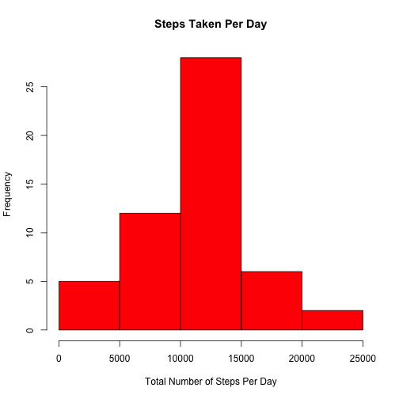
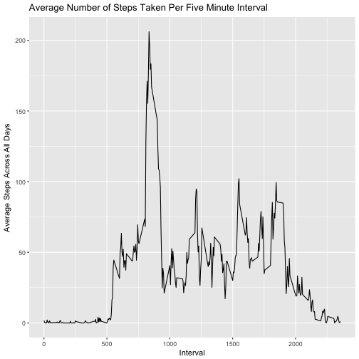
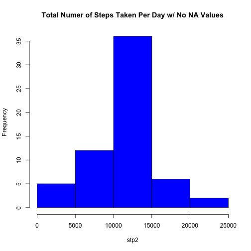
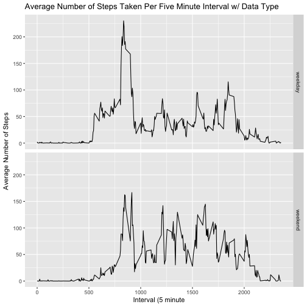

Assignment 1 - Activity Monitoring Data
=======================================

First we will unzip the data and download the files

```r
url1 <- "https://d396qusza40orc.cloudfront.net/repdata%2Fdata%2Factivity.zip"
download.file(url1, "activity.zip" )
unzip("activity.zip")
```
Now we will download the activity data from the zipfile 
and then look at the first 5 rows with head of rows

```r
act <- read.csv("activity.csv", header = TRUE)
head(act)
```

```
##   steps       date interval
## 1    NA 2012-10-01        0
## 2    NA 2012-10-01        5
## 3    NA 2012-10-01       10
## 4    NA 2012-10-01       15
## 5    NA 2012-10-01       20
## 6    NA 2012-10-01       25
```
In the first five rows we see that their are NA values for steps taken
We know we will have to ignore NA values when possible
Lets see if there is anything else we will need to change
first lets take the classes of each column

```r
class(act$steps)
```

```
## [1] "integer"
```

```r
class(act$date)
```

```
## [1] "factor"
```

```r
class(act$interval)
```

```
## [1] "integer"
```
Since both 'act$step' and 'act$interval' are numeric they can stay integers
'act$dates' however needs to be in the class dates. Lets change this now.
To do this lets take steps out of the act object and place it in a list.
Then lets follow up by re-inserting the dates into the act date frame.

```r
act$date <- as.Date(act$date)
class(act$date)
```

```
## [1] "Date"
```
After we take the class again we see the date is in the correct format.
Now lets see how many dates have NA values. We can assume that if a 
device was recording values on that day it will have a value of >1. 

```r
stp <- with(act, tapply(steps, date, FUN = sum))
stp
```

```
## 2012-10-01 2012-10-02 2012-10-03 2012-10-04 2012-10-05 2012-10-06 
##         NA        126      11352      12116      13294      15420 
## 2012-10-07 2012-10-08 2012-10-09 2012-10-10 2012-10-11 2012-10-12 
##      11015         NA      12811       9900      10304      17382 
## 2012-10-13 2012-10-14 2012-10-15 2012-10-16 2012-10-17 2012-10-18 
##      12426      15098      10139      15084      13452      10056 
## 2012-10-19 2012-10-20 2012-10-21 2012-10-22 2012-10-23 2012-10-24 
##      11829      10395       8821      13460       8918       8355 
## 2012-10-25 2012-10-26 2012-10-27 2012-10-28 2012-10-29 2012-10-30 
##       2492       6778      10119      11458       5018       9819 
## 2012-10-31 2012-11-01 2012-11-02 2012-11-03 2012-11-04 2012-11-05 
##      15414         NA      10600      10571         NA      10439 
## 2012-11-06 2012-11-07 2012-11-08 2012-11-09 2012-11-10 2012-11-11 
##       8334      12883       3219         NA         NA      12608 
## 2012-11-12 2012-11-13 2012-11-14 2012-11-15 2012-11-16 2012-11-17 
##      10765       7336         NA         41       5441      14339 
## 2012-11-18 2012-11-19 2012-11-20 2012-11-21 2012-11-22 2012-11-23 
##      15110       8841       4472      12787      20427      21194 
## 2012-11-24 2012-11-25 2012-11-26 2012-11-27 2012-11-28 2012-11-29 
##      14478      11834      11162      13646      10183       7047 
## 2012-11-30 
##         NA
```
We see from the output that there are atleast eight dates with values < 1.
This could either mean their was a malfunction, they didn't wear the device, or 
whoever was weaering it didn't move all day. Which is highly unlikely, but possible and concerning. 

Lets create a histogram the shape of our daily step data.

```r
hist(stp, main = "Steps Taken Per Day", xlab  = "Total Number of Steps Per Day", col = "red")
```




we can tell from the histogram that a majority of the dates had between 10,000 and 15,000
steps taken. To see if this is accurate lets take the mean and median of the 'stp' object
we created to see if it matches the histogram. 

```r
summary(stp)
```

```
##    Min. 1st Qu.  Median    Mean 3rd Qu.    Max.    NA's 
##      41    8841   10765   10766   13294   21194       8
```

It seems to match up pretty closely to the histogram so we can assume that the data our hist plot displays is accurate.
 
Now lets look at how the steps data matches up per interval for all the recorded data.
First lets take the mean of the steap for each unique interval.

```r
mvd <- aggregate(steps ~ interval, act, mean)
```
Now we have a data frame containing the average data for each interval over each date.
Lets use ggplot2 to see which interval has the highest, average number of steps.

```r
library(ggplot2)
g <- ggplot(aes(x = interval, y = steps), data = mvd)
g + geom_line()+ labs(title = "Average Number of Steps Taken Per Five Minute Interval") +
  ylab("Average Steps Across All Days") + xlab("Interval")
```



it looks like around interval 800 there is an average of about 206 steps.
We that ther were alot of missing values while using the head function on the data earlier.
Lets see exactly how man there are in our 'act' object to determine if it will be a problem.

```r
sum(is.na(act$steps))
```

```
## [1] 2304
```

```r
mean(is.na(act$steps))
```

```
## [1] 0.1311475
```
It looks like we have 2304 NA values or just around 13% of the data missing.
This seems pretty high. Lets see if we can fix the data set by filling all of those missing values based on the number of steps for a specific interval averaged across all days.

```r
new_act <- act
for(i in 1:nrow(new_act)){
  if(is.na(new_act$steps[i])){
    new_act$steps[i] <- mvd[which(new_act$interval[i] == mvd$interval), ]$steps
  }
}
```
Now lets check and see if there are any NA values left over

```r
sum(is.na(new_act))
```

```
## [1] 0
```
As we can see there aren't.
Now lets see how this effects the shape of the data in a histogram. 
First lets aggregate the sums again.

```r
stp2 <- with(new_act, tapply(steps, date, FUN = sum))
hist(stp2, main = "Total Numer of Steps Taken Per Day w/ No NA Values", col = "blue")
```



```r
summary(stp2)
```

```
##    Min. 1st Qu.  Median    Mean 3rd Qu.    Max. 
##      41    9819   10766   10766   12811   21194
```
We can see from the histogram and the mean and median that there really is no major difference between the data sets.

now lets make a new factor varialb to determine if there is difference in the amount of steps taken on a weeday or weekend.

```r
new_act$date.type <- ifelse(as.POSIXlt(new_act$date)$wday %in% c(0,6), "weekend", "weekday")
```
Now lets makea time series plot to compare the average steps for each interval averaged across all weekdays and weekends.

```r
avgActivity <- aggregate(steps~interval+date.type, data = new_act, mean)
h <- ggplot(aes(interval, steps), data = avgActivity)
h + geom_line() + facet_grid(date.type ~ .) + 
  xlab("Interval (5 minute") + ylab("Average Number of Steps") + 
  labs(title = "Average Number of Steps Taken Per Five Minute Interval w/ Data Type")
```



Now we can see where the highest average steps are taken during each interval for both the weekdays and weekend.
